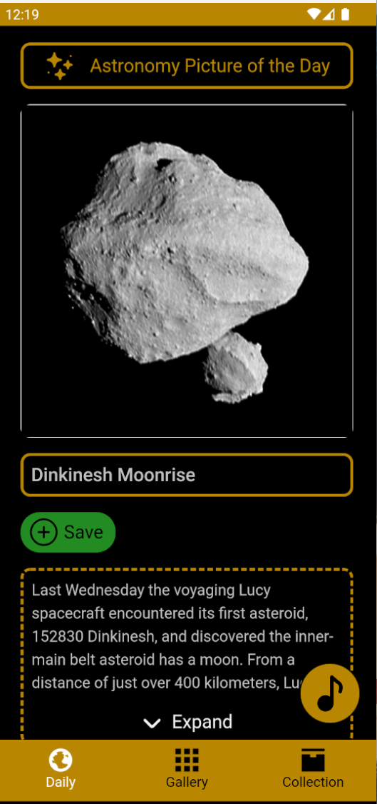

# Stargazer

This application is a mobile app developed with MAUI Blazor. Its purpose is to allow the user to view, collect and organize images of different astronomical phenomena. It achives this by presenting the user with a daily image consisting of Na. 

 
